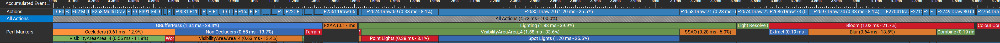

I started this project at the end of 2020 when I discovered that a favorite game of mine, SOMA, has a large modding community that the developers (Frictional Games) encoriages via their Discord, most of the files for the game are therefore mostly in open/common formats including maps, terrain, models and script - this is very rare! Excited at the possibilities that a dataset like this enables, and looking for a reason to re-write my old Java engine in C#, I promptly started hacking something up (this is why you may see references to my old engine GLOOP).

To accomidate SOMA's asset dataset, many code paths have been added in order to mimic its orginal HPL Engine. Currently the project mainly focuses on the use of these assets over anything else, developing any feature required to get them intergrated. Leveraging these production assets also allows many learning oppertunities I wouldn't otherwise get basic test scenes with cubes and spheres I would otherwise have to resort to (and was a real issue in my previous engine).

Paralell to the "cloning" objective, this project also
As I learned more and more about Frictional Game's HPL Engine, reverse engineering it in debuggers the more I understood its design and objectives, specifically, portability over performance, only making use of OpenGL 3.x features. So I set myself another goal, to outperform HPL Engine by using OpenGL 4.3 features, optimizing and upgrading rendering techniques where possible. 

Progress is slowly being made integrating assets, maybe one day most of the assets will be working and a level will be playable...

XYZ-Engine is a placeholder name. I've never been one for naming things.

## Features
- Production assets
- Rendering
    
    - Deferred shading
    - OpenGL 4.3 features including MultiDraw*Indirect
    - Bloom
    - FXAA
    - SSAO
    - Multi-layer splat terrain
    - Portal culling
    - Frustum culling
    - VR support
- Utility

    - Automatic GPU buffer management
    - ImGUI integration
    - OpenVR integration
    - Background task manager
    - Profiler
    - Debug groups for NSight
    - Debugging compiles out in production build

- HPL porting progress

    - Terrain
    - Static Objects
    - Entities
    - Detail meshes
    - Primitives
    - Areas
    - Lights

## Design
Just like my previous engine, this one is designed to be layered to abstract away complexity to allow faster iteration but also expose lower-levels when the time comes to polish. 

It has no set architecture, as it is designed more like a framework or toolset, with lots of utilities that anyone can quickly slap together a basic renderer (check out the basic text for an example).
